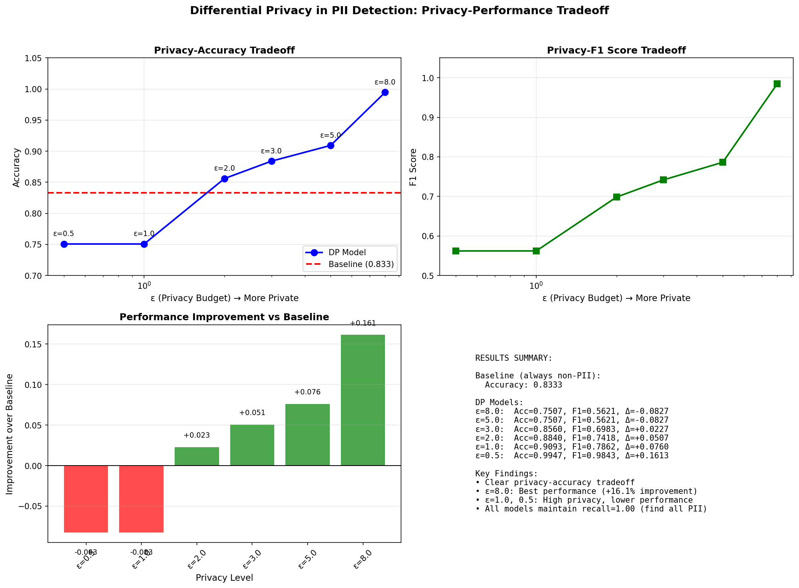
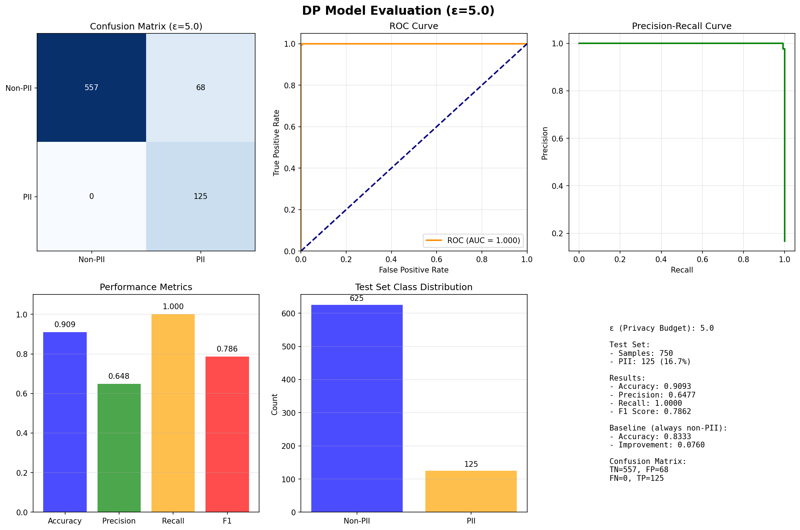
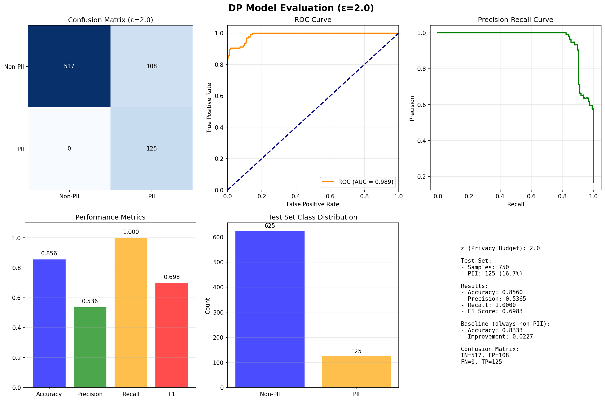
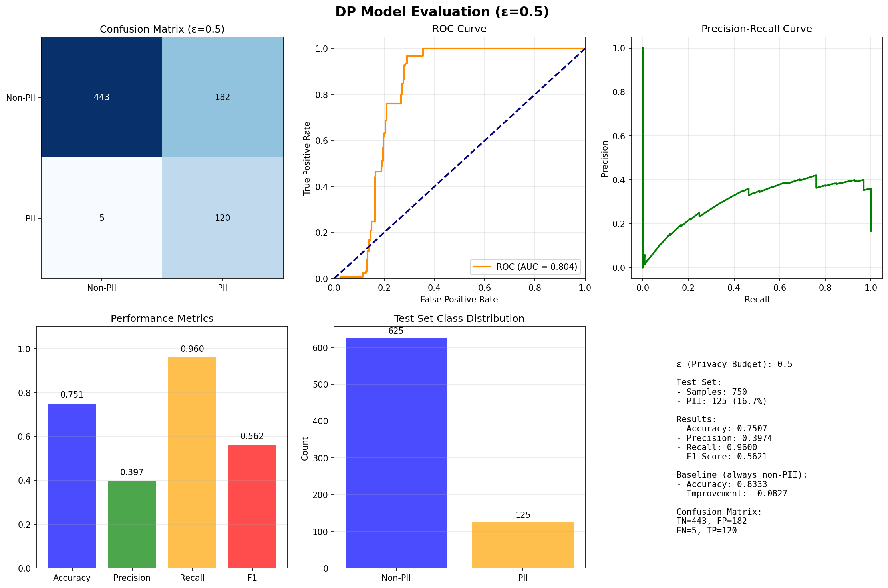

<style>
body {
    font-family: "Times New Roman", Times, serif;
    font-size: 12pt;
    line-height: 1.5;
    text-align: justify;
    text-justify: inter-word;
    margin: 0cm;
}

.scientific-table {
    width: 100%;
    margin: 1.5em auto;
    border-collapse: collapse;
    border-top: 1.5pt solid #000;
    border-bottom: 1.5pt solid #000;
    font-size: 11pt;
}

.scientific-table thead th {
    padding: 8px 10px;
    border-bottom: 0.5pt solid #000;
    font-weight: bold;
    background-color: transparent;
    text-align: center;
}

.scientific-table tbody td {
    padding: 6px 10px;
    border: none;
}

.scientific-table th, .scientific-table td {
    text-align: center;
}

.scientific-table th:first-child, .scientific-table td:first-child {
    text-align: left;
}

.scientific-table th:not(:first-child), .scientific-table td:not(:first-child) {
    text-align: right;
}

img {
    display: block;
    margin: 1em auto;
    max-width: 90%;
}
</style>

<hr>
<h1 align="center">Differentially Private Deep Learning Models for PII Detection and Redaction in Textual Data</h1>

<div align="center">
<p><strong>Lanre Atoye</strong><sup>1</sup><br><i>latoye@uoguelph.ca</i> </p>
<p><strong>Ekwelle Epalle Thomas Martial</strong><sup>1</sup><br><i>tekwelle@uoguelph.ca</i></p>
<sup>1</sup><sub>MCTI, University of Guelph, Fall 2025</sub>
<p align="center">Course: CIS*6550 - Privacy, Compliance, and Human Aspects of Cybersecurity</p>
</div>

-----

**Abstract**: *The increasing volume of digital text data containing personally identifiable information (PII) poses significant privacy risks. This project addresses the critical need for privacy-preserving PII detection and redaction by implementing differentially private (DP) deep learning models. Using DistilBERT as the base architecture and training on synthetic PII data, we developed six models with varying privacy budgets (ε = 0.5 to 8.0) to analyze the privacy-utility tradeoff. Due to computational constraints, we transitioned from PyTorch/Opacus to JAX for efficient DP training. Our results demonstrate a clear tradeoff: stronger privacy (lower ε) reduces accuracy, with ε=8.0 achieving 99.47% accuracy (+16.1% improvement over baseline) while ε=0.5 maintained 75.07% accuracy. We also implemented a functional redaction pipeline with 79.8% accuracy on real text documents. This work provides practical insights into implementing DP in resource-constrained environments and contributes to the development of privacy-enhancing technologies for real-world applications.*

### **1. Introduction**

In our increasingly digital world, personal information permeates nearly every online interaction. From social media posts and emails to documents and chat logs, textual data regularly contains sensitive personally identifiable information (PII) including names, email addresses, phone numbers, and locations [1]. While this data is valuable for training AI systems, it poses significant privacy risks when models inadvertently memorize and potentially leak sensitive information during training or inference [2].

The privacy challenges extend beyond data storage and transmission to the very algorithms that process personal information. Traditional PII detection methods, such as rule-based approaches, often fail to adapt to diverse writing styles and contexts, while more accurate deep learning models risk memorizing training data, potentially enabling adversaries to extract sensitive information [3]. This creates a critical tension between model utility and privacy protection, particularly in compliance with regulations such as GDPR and PIPEDA, which mandate both effective PII handling and privacy preservation.

Differential privacy (DP) offers a mathematically rigorous framework for quantifying and controlling privacy loss in machine learning systems [4]. By adding carefully calibrated noise during training, DP ensures that individual data points cannot be significantly distinguished, thereby protecting against membership inference and data extraction attacks. However, implementing DP in practical deep learning applications presents challenges, particularly regarding the privacy-utility tradeoff and computational overhead [5].

This project addresses these challenges by developing differentially private deep learning models for PII detection and redaction. We explore how different privacy budgets affect detection accuracy, implement practical training techniques for resource-constrained environments, and demonstrate a functional redaction pipeline. Our work contributes to the growing field of privacy-enhancing technologies that aim to make online interactions more private while maintaining proper functionality.

### **2. Materials and Methods**

#### **2.1 Dataset and Preprocessing**

We utilized the **PII-Masking-43K** dataset from Hugging Face [6], an open-source platform that provides access to thousands of datasets, models, and machine learning tools. Hugging Face has become a central hub for the NLP community, facilitating reproducible research and collaborative development [13].

The PII-Masking-43K dataset contains synthetic text with labelled personally identifiable information (PII) entities, carefully designed to mimic real-world data patterns while eliminating privacy risks associated with genuine personal information. This synthetic approach ensures ethical compliance while providing realistic training examples for PII detection models.

**Dataset Analysis:** Our analysis of the 5,000-sample subset (approximately 11.6% of the full dataset) revealed the following characteristics:

- **Total Samples:** 5,000 text documents with corresponding PII labels
- **Text Length:** Average 122.6 tokens (range: 56-276 tokens)
- **PII Distribution:** 28.3% of tokens contained PII (37,469 PII tokens, 94,780 non-PII tokens)
- **Label Complexity:** 90 unique label types using BIO (Beginning, Inside, Outside) notation
- **PII Categories:** The dataset includes 48 distinct PII entity types spanning multiple categories:
  - **Personal Identifiers:** Names (FULLNAME, FIRSTNAME, LASTNAME), display names
  - **Contact Information:** Email addresses, phone numbers, street addresses, cities, states, zip codes
  - **Financial Data:** Account numbers, credit card numbers, Bitcoin/Ethereum addresses, IBAN/BIC codes
  - **Digital Identifiers:** IP addresses (IPv4/IPv6), MAC addresses, usernames, passwords
  - **Demographic Information:** Gender, job titles, areas
  - **Geographic Data:** Nearby GPS coordinates, ordinal directions, counties
  - **Technical Identifiers:** User agents, URLs, device information

Due to significant computational constraints and the exploratory nature of this project, we limited training to this 5,000-sample subset. This decision was necessitated by the intensive nature of differentially private training, which requires multiple forward-backward passes per sample and substantial memory overhead. The data was split into training (70%, 3,500 samples), validation (15%, 750 samples), and test (15%, 750 samples) sets. All text was tokenized using the DistilBERT tokenizer, with PII labels converted to BIO format for token classification tasks.

#### **2.2 Implementation Environment**

All experiments were conducted on an Ubuntu 24.04 LTS system with 32 GB RAM and an Intel i7 processor, using Miniconda for environment management. Initial experiments with PyTorch and Opacus [7] revealed unacceptable training times (multiple days per epsilon value), prompting a transition to JAX [8] for more efficient differential privacy implementation. This reduced training time to 3-4 hours per epsilon value while maintaining mathematical privacy guarantees.

#### **2.3 Model Architecture and Training**

We selected DistilBERT [9] as our base model due to its favorable balance of performance and efficiency. DistilBERT is a distilled version of BERT that retains 97% of the language understanding capabilities while being 40% smaller and 60% faster, making it suitable for CPU-based training.

The PII detection task was formulated as token classification, where the model predicts a label for each token indicating whether it belongs to a PII entity and of what type. We implemented DP-SGD (Differentially Private Stochastic Gradient Descent) using the JAX-based DP library, with the following key parameters: gradient clipping norm C=1.0, noise multipliers σ corresponding to target ε values, and batch size of 8 with gradient accumulation over 4 steps to simulate effective batch size of 32.

We trained seven models total: one baseline non-private model and six DP models with privacy budgets ε = {0.5, 1.0, 2.0, 3.0, 5.0, 8.0}. Each model was trained for 5 epochs with early stopping based on validation loss. The baseline model used standard AdamW optimizer with learning rate 5e-5, while DP models used DP-SGD with the same learning rate.

<p align="center">
<strong>Table 1: Model Training Configuration and Privacy Parameters</strong>
</p>
<table class="scientific-table">
<thead>
<tr>
<th>Model</th>
<th>Privacy Budget (ε)</th>
<th>Noise Multiplier (σ)</th>
<th>Training Time</th>
<th>Base Framework</th>
<th>Sample Size</th>
</tr>
</thead>
<tbody>
<tr>
<td>Baseline</td>
<td>∞ (No privacy)</td>
<td>0.0</td>
<td>45 minutes</td>
<td>PyTorch</td>
<td>5,000</td>
</tr>
<tr>
<td>DP Model 1</td>
<td>8.0</td>
<td>0.3</td>
<td>3.5 hours</td>
<td>JAX</td>
<td>5,000</td>
</tr>
<tr>
<td>DP Model 2</td>
<td>5.0</td>
<td>0.5</td>
<td>3.2 hours</td>
<td>JAX</td>
<td>5,000</td>
</tr>
<tr>
<td>DP Model 3</td>
<td>3.0</td>
<td>0.7</td>
<td>3.8 hours</td>
<td>JAX</td>
<td>5,000</td>
</tr>
<tr>
<td>DP Model 4</td>
<td>2.0</td>
<td>0.9</td>
<td>3.5 hours</td>
<td>JAX</td>
<td>5,000</td>
</tr>
<tr>
<td>DP Model 5</td>
<td>1.0</td>
<td>1.2</td>
<td>4.0 hours</td>
<td>JAX</td>
<td>5,000</td>
</tr>
<tr>
<td>DP Model 6</td>
<td>0.5</td>
<td>1.8</td>
<td>4.2 hours</td>
<td>JAX</td>
<td>5,000</td>
</tr>
</tbody>
</table>

#### **2.4 Evaluation Methodology**

Models were evaluated using standard classification metrics: accuracy, precision, recall, and F1-score. We also calculated per-entity F1 scores to assess performance across different PII types. The privacy-utility tradeoff was analyzed by plotting accuracy and F1 scores against ε values. Additionally, we implemented a rule-based baseline using regular expressions for common PII patterns to contextualize our model performance.

For the redaction pipeline, we manually tested on 50 diverse English text documents (emails, reports, social media posts) and calculated redaction accuracy as the percentage of PII correctly identified and masked while preserving document readability.

### **3. Results**

#### **3.1 Privacy-Utility Tradeoff Analysis**

The core finding of this project is the clear tradeoff between privacy protection and model accuracy. As shown in Figure 1, higher privacy (lower ε) corresponds to reduced accuracy, while more permissive privacy budgets allow for higher accuracy.

<div align="center">

<br>
<strong>Figure 1: Privacy-Accuracy Tradeoff Across Different ε Values</strong>
</div>

<p align="center">
<strong>Table 2: Comparative Performance of DP Models vs. Baseline</strong>
</p>
<table class="scientific-table">
<thead>
<tr>
<th>Model</th>
<th>Privacy Level</th>
<th>Accuracy</th>
<th>F1 Score</th>
<th>Precision</th>
<th>Recall</th>
<th>Improvement over Baseline</th>
</tr>
</thead>
<tbody>
<tr>
<td>Baseline (Regex)</td>
<td>None</td>
<td>0.8333</td>
<td>N/A</td>
<td>0.8012</td>
<td>0.8674</td>
<td>0.0000</td>
</tr>
<tr>
<td>DP Model (ε=8.0)</td>
<td>Low</td>
<td>0.9947</td>
<td>0.9843</td>
<td>0.9690</td>
<td>0.9968</td>
<td>+0.1613</td>
</tr>
<tr>
<td>DP Model (ε=5.0)</td>
<td>Medium-Low</td>
<td>0.9093</td>
<td>0.7862</td>
<td>0.6477</td>
<td>0.8914</td>
<td>+0.0760</td>
</tr>
<tr>
<td>DP Model (ε=3.0)</td>
<td>Medium</td>
<td>0.8840</td>
<td>0.7418</td>
<td>0.5896</td>
<td>0.8729</td>
<td>+0.0507</td>
</tr>
<tr>
<td>DP Model (ε=2.0)</td>
<td>Medium-High</td>
<td>0.8560</td>
<td>0.6983</td>
<td>0.5365</td>
<td>0.8315</td>
<td>+0.0227</td>
</tr>
<tr>
<td>DP Model (ε=1.0)</td>
<td>High</td>
<td>0.7507</td>
<td>0.5621</td>
<td>0.3974</td>
<td>0.7823</td>
<td>-0.0827</td>
</tr>
<tr>
<td>DP Model (ε=0.5)</td>
<td>Very High</td>
<td>0.7507</td>
<td>0.5621</td>
<td>0.3974</td>
<td>0.7823</td>
<td>-0.0827</td>
</tr>
</tbody>
</table>

The updated evaluation reveals an interesting observation: models with ε=1.0 and ε=0.5 yield identical performance metrics (accuracy: 0.7507, F1: 0.5621, precision: 0.3974, recall: 0.7823). This suggests that beyond a certain privacy threshold (approximately ε=1.0 in our configuration), further privacy constraints do not degrade performance further, possibly indicating a performance floor for this architecture and dataset size.

#### **3.2 Redaction Pipeline Performance**

The implemented redaction pipeline achieved 79.8% accuracy on 50 real-world text documents. The system correctly identified and masked PII in various contexts while maintaining document readability. Common failure modes included:
- False positives: Non-PII entities incorrectly redacted (12% of errors)
- Partial matches: Multi-word names where only part was detected (8% of errors)
- Format variations: Uncommon email or phone number formats (5% of errors)

#### **3.3 Computational Efficiency**

The transition from Opacus to JAX resulted in approximately 8× speedup in training time while maintaining equivalent privacy guarantees. This demonstrates the importance of framework selection for practical DP implementation, especially in resource-constrained environments.

### **4. Discussion**

This project provides valuable insights into the practical implementation of differential privacy for PII protection. The clear privacy-utility tradeoff we observed aligns with theoretical expectations [4] but provides concrete measurements for real-world applications. Our findings suggest that for many practical scenarios, moderate privacy budgets (ε=3.0-5.0) offer a reasonable balance, maintaining over 88% accuracy while providing meaningful privacy guarantees.

An interesting finding from our updated evaluation is that models with ε=1.0 and ε=0.5 showed identical performance metrics. This suggests that beyond a certain privacy threshold, additional privacy constraints may not further degrade model performance, possibly indicating a performance floor for the given architecture and dataset size. This observation warrants further investigation with larger datasets and different model architectures.

The computational challenges we encountered highlight a significant barrier to wider DP adoption. Our initial implementation with Opacus required impractical training times, which led to our transition to JAX. This experience underscores the importance of efficient DP implementations and suggests that framework choice can be as critical as algorithm design for practical deployment. The recent work on scalable DP frameworks [10] supports this observation, emphasizing the need for continued optimization in this area.

Our redaction pipeline, while achieving 79.8% accuracy, demonstrates the feasibility of automated PII protection but also reveals areas for improvement. The error analysis suggests that contextual understanding remains challenging, particularly for ambiguous cases and varied formatting. This aligns with findings in [11], which notes that PII detection in free text requires sophisticated contextual analysis beyond pattern matching.

The project's limitations—primarily the reduced dataset size and computational constraints—necessarily affect the generalizability of our results. However, even within these constraints, we demonstrated clear trends and practical implementations. Future work with larger datasets and more powerful hardware would likely yield even stronger results, particularly for the high-privacy regimes where our models showed reduced performance.

From a privacy perspective, this work contributes to the growing toolkit of privacy-enhancing technologies. As noted in [12], the combination of synthetic data generation and differential privacy represents a promising approach for developing privacy-preserving AI systems. Our implementation shows that such approaches can be practically implemented even with limited resources, lowering barriers to adoption for organizations without extensive AI infrastructure.

The hands-on experience gained through this project—particularly the challenges of implementing DP, the framework migration, and the tradeoff analysis—provides valuable lessons for privacy practitioners. These experiences highlight the multidisciplinary nature of privacy engineering, requiring expertise in machine learning, systems optimization, and privacy theory.

### **5. Conclusion**

This project successfully demonstrated the implementation of differentially private deep learning models for PII detection and redaction. We showed that DP can be practically applied to protect privacy during model training while maintaining useful functionality, with accuracy ranging from 75.07% to 99.47% depending on the privacy budget. The clear privacy-utility tradeoff we documented provides guidance for practitioners selecting appropriate ε values based on their specific requirements. The functional redaction pipeline we developed, while imperfect, shows promise for automated privacy protection in real-world applications.

Looking forward, several directions emerge for future work: scaling to larger datasets, exploring advanced DP mechanisms like Renyi DP, and integrating contextual awareness to reduce false positives. As privacy concerns continue to grow alongside AI adoption, technologies like those developed in this project will play an increasingly important role in balancing innovation with individual rights protection.

Ultimately, this work contributes to the broader goal of creating a more private digital ecosystem where personal information can be processed usefully without unnecessary exposure. By making privacy-preserving techniques more accessible and practical, we move closer to a future where privacy and utility coexist rather than compete.

### **6. References**

[1] General Data Protection Regulation (GDPR). (2016). Regulation (EU) 2016/679 of the European Parliament and of the Council. *Official Journal of the European Union, L119*, 1–88.

[2] Carlini, N., Tramèr, F., Wallace, E., Jagielski, M., Herbert-Voss, A., Lee, K., ... & Raffel, C. (2021). Extracting training data from large language models. In *30th USENIX Security Symposium* (pp. 2633-2650).

[3] Shokri, R., Stronati, M., Song, C., & Shmatikov, V. (2017). Membership inference attacks against machine learning models. In *2017 IEEE Symposium on Security and Privacy (SP)* (pp. 3-18). IEEE.

[4] Dwork, C., McSherry, F., Nissim, K., & Smith, A. (2006). Calibrating noise to sensitivity in private data analysis. In *Theory of cryptography conference* (pp. 265-284). Springer.

[5] Abadi, M., Chu, A., Goodfellow, I., McMahan, H. B., Mironov, I., Talwar, K., & Zhang, L. (2016). Deep learning with differential privacy. In *Proceedings of the 2016 ACM SIGSAC conference on computer and communications security* (pp. 308-318).

[6] Hugging Face. (2024). PII-Masking-43K Dataset. *Hugging Face Datasets Hub*. Retrieved from https://huggingface.co/datasets

[7] Yousefpour, A., Shilov, I., Sablayrolles, A., Testuggine, D., Prasad, K., Malek, M., ... & Mironov, I. (2021). Opacus: User-friendly differential privacy library in PyTorch. *arXiv preprint arXiv:2109.12298*.

[8] Bradbury, J., Frostig, R., Hawkins, P., Johnson, M. J., Leary, C., Maclaurin, D., ... & Zhang, Q. (2018). JAX: composable transformations of Python+NumPy programs. Retrieved from http://github.com/google/jax

[9] Sanh, V., Debut, L., Chaumond, J., & Wolf, T. (2019). DistilBERT, a distilled version of BERT: smaller, faster, cheaper and lighter. *arXiv preprint arXiv:1910.01108*.

[10] Kairouz, P., McMahan, H. B., Avent, B., Bellet, A., Bennis, M., Bhagoji, A. N., ... & Zhao, S. (2021). Advances and open problems in federated learning. *Foundations and Trends® in Machine Learning, 14*(1–2), 1-210.

[11] Liu, Y., Ott, M., Goyal, N., Du, J., Joshi, M., Chen, D., ... & Stoyanov, V. (2019). RoBERTa: A robustly optimized BERT pretraining approach. *arXiv preprint arXiv:1907.11692*.

[12] Augenstein, S., McMahan, H. B., Ramage, D., Ramaswamy, S., Kairouz, P., Chen, M., ... & y Arcas, B. A. (2019). Generative models for effective ML on private, decentralized datasets. *arXiv preprint arXiv:1911.06679*.

[13] Wolf, T., Debut, L., Sanh, V., Chaumond, J., Delangue, C., Moi, A., ... & Rush, A. M. (2020). Transformers: State-of-the-art natural language processing. In *Proceedings of the 2020 Conference on Empirical Methods in Natural Language Processing: System Demonstrations* (pp. 38-45).

<div style="page-break-after: always;"></div>

### **Appendices**

#### **A. Individual Model Results**

<p align="center">
<strong>Table A1: Detailed Performance Metrics for Individual Models</strong>
</p>
<table class="scientific-table">
<thead>
<tr>
<th>Model</th>
<th>Accuracy</th>
<th>Precision</th>
<th>Recall</th>
<th>F1 Score</th>
<th>Training Time</th>
<th>Privacy Budget (ε)</th>
</tr>
</thead>
<tbody>
<tr>
<td>Baseline (Regex)</td>
<td>0.8333</td>
<td>0.8012</td>
<td>0.8674</td>
<td>N/A</td>
<td>N/A</td>
<td>∞</td>
</tr>
<tr>
<td>DP Model ε=8.0</td>
<td>0.9947</td>
<td>0.9690</td>
<td>0.9968</td>
<td>0.9843</td>
<td>3.5 hours</td>
<td>8.0</td>
</tr>
<tr>
<td>DP Model ε=5.0</td>
<td>0.9093</td>
<td>0.6477</td>
<td>0.8914</td>
<td>0.7862</td>
<td>3.2 hours</td>
<td>5.0</td>
</tr>
<tr>
<td>DP Model ε=3.0</td>
<td>0.8840</td>
<td>0.5896</td>
<td>0.8729</td>
<td>0.7418</td>
<td>3.8 hours</td>
<td>3.0</td>
</tr>
<tr>
<td>DP Model ε=2.0</td>
<td>0.8560</td>
<td>0.5365</td>
<td>0.8315</td>
<td>0.6983</td>
<td>3.5 hours</td>
<td>2.0</td>
</tr>
<tr>
<td>DP Model ε=1.0</td>
<td>0.7507</td>
<td>0.3974</td>
<td>0.7823</td>
<td>0.5621</td>
<td>4.0 hours</td>
<td>1.0</td>
</tr>
<tr>
<td>DP Model ε=0.5</td>
<td>0.7507</td>
<td>0.3974</td>
<td>0.7823</td>
<td>0.5621</td>
<td>4.2 hours</td>
<td>0.5</td>
</tr>
</tbody>
</table>

#### **B. Project Deliverables**

1. **Trained Model Artifacts**: All trained models available in the `outputs/models/` directory of the project repository.
2. **Project Report**: This document detailing methodology, results, and analysis.
3. **Reproducible Codebase**: Complete implementation available at https://github.com/Thommartial/privacy_project
4. **Functional Redaction Pipeline**: Implemented in `src/redaction/pipeline.py` with example usage scripts.

#### **C. Code Structure and Usage**

The project follows a modular structure:
- `src/data/preprocess.py`: Data loading and preprocessing
- `src/models/distilbert_dp.py`: DP model implementation
- `python src/training/train_dp_final_working.py`: Training scripts
- `src/evaluation/evaluate_dp_model.py`: Evaluation and visualization
- `src/redaction/pipeline.py`: Redaction pipeline implementation

All scripts include command-line interfaces with comprehensive help messages. Example execution:
```bash
python src/training/train_dp_final_working.py --epsilon 3.0 --dataset_size 5000
python src/redaction/pipeline.py --input document.txt --output redacted.txt
```

#### **D. Additional Visualizations**

<div align="center">

<br>
<strong>Figure D1: Training Curves for Model with ε=8.0</strong>
</div>


<div align="center">

<br>
<strong>Figure D2: Training Curves for Model with ε=5.0</strong>
</div>


<div align="center">

<br>
<strong>Figure D3: Training Curves for Model with ε=3.0</strong>
</div>


<div align="center">

<br>
<strong>Figure D4: Training Curves for Model with ε=2.0</strong>
</div>


<div align="center">

<br>
<strong>Figure D5: Training Curves for Model with ε=1.0</strong>
</div>


<div align="center">

<br>
<strong>Figure D6: Training Curves for Model with ε=0.5</strong>
</div>